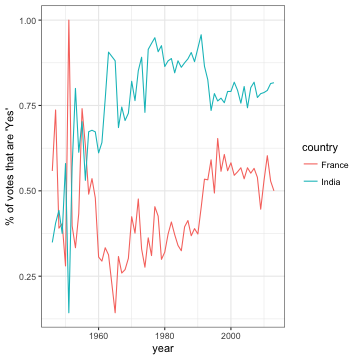

<!-- README.md is generated from README.Rmd. Please edit that file -->


## United Nations General Assembly Voting Data

This package provides the voting history of countries in the [United Nations General Assembly](http://www.un.org/en/ga/), along with information such as date, description, and topics for each vote.

These come from the dataset [found here](https://dataverse.harvard.edu/dataset.xhtml?persistentId=hdl:1902.1/12379):

Erik Voeten "Data and Analyses of Voting in the UN General Assembly" Routledge Handbook of International Organization, edited by Bob Reinalda (published May 27, 2013)

This raw data, and the processing script, can be found in the [data-raw](data-raw) folder.

### Datasets

The package contains three datasets. First is the history of each vote for each country:


```r
library(ungavotes)

un_votes
#> Source: local data frame [711,275 x 3]
#> 
#>     rcid  vote     country
#>    <dbl> <dbl>       <chr>
#> 1      3     2       Egypt
#> 2      3     1    Honduras
#> 3      3     1  Costa Rica
#> 4      3     1 El Salvador
#> 5      3     3      France
#> 6      3     1     Uruguay
#> 7      3     1       Chile
#> 8      3     1     Ecuador
#> 9      3     1   Argentina
#> 10     3     1       Haiti
#> ..   ...   ...         ...
```


```r
un_roll_calls
#> Source: local data frame [5,356 x 9]
#> 
#>     rcid session importantvote       date   unres amend  para
#>    <dbl>   <dbl>         <dbl>     <date>   <chr> <dbl> <dbl>
#> 1      3       1             0 1946-01-01  R/1/66     1     0
#> 2      4       1             0 1946-01-02  R/1/79     0     0
#> 3      5       1             0 1946-01-04  R/1/98     0     0
#> 4      6       1             0 1946-01-04 R/1/107     0     0
#> 5      7       1             0 1946-01-02 R/1/295     1     0
#> 6      8       1             0 1946-01-05 R/1/297     1     0
#> 7      9       1             0 1946-02-05 R/1/329     0     0
#> 8     10       1             0 1946-02-05 R/1/361     1     1
#> 9     11       1             0 1946-02-05 R/1/376     0     0
#> 10    12       1             0 1946-02-06 R/1/394     1     1
#> ..   ...     ...           ...        ...     ...   ...   ...
#> Variables not shown: short <chr>, descr <chr>.
```

Finally, there is a dataset with connections of each vote to 6 issues:


```r
un_roll_call_issues
#> Source: local data frame [4,951 x 3]
#> 
#>     rcid short_name                issue
#>    <dbl>      <chr>                <chr>
#> 1     30         me Palestinian conflict
#> 2     34         me Palestinian conflict
#> 3     77         me Palestinian conflict
#> 4   9002         me Palestinian conflict
#> 5   9003         me Palestinian conflict
#> 6   9004         me Palestinian conflict
#> 7   9005         me Palestinian conflict
#> 8   9006         me Palestinian conflict
#> 9    128         me Palestinian conflict
#> 10   129         me Palestinian conflict
#> ..   ...        ...                  ...

library(dplyr)
count(un_roll_call_issues, issue, sort = TRUE)
#> Source: local data frame [6 x 2]
#> 
#>                                  issue     n
#>                                  <chr> <int>
#> 1                 Palestinian conflict  1047
#> 2                          Colonialism   971
#> 3                         Human rights   901
#> 4         Arms control and disarmament   859
#> 5 Nuclear weapons and nuclear material   712
#> 6                 Economic development   461
```

(Use `help()` to get information and documentation about each dataset).

### Example analysis

Many useful analyses will first involve joining the vote and roll call datasets by the shared `rcid` (roll call ID) column:


```r
library(dplyr)

joined <- un_votes %>%
  inner_join(un_roll_calls, by = "rcid")

joined
#> Source: local data frame [711,275 x 11]
#> 
#>     rcid  vote     country session importantvote       date  unres amend
#>    <dbl> <dbl>       <chr>   <dbl>         <dbl>     <date>  <chr> <dbl>
#> 1      3     2       Egypt       1             0 1946-01-01 R/1/66     1
#> 2      3     1    Honduras       1             0 1946-01-01 R/1/66     1
#> 3      3     1  Costa Rica       1             0 1946-01-01 R/1/66     1
#> 4      3     1 El Salvador       1             0 1946-01-01 R/1/66     1
#> 5      3     3      France       1             0 1946-01-01 R/1/66     1
#> 6      3     1     Uruguay       1             0 1946-01-01 R/1/66     1
#> 7      3     1       Chile       1             0 1946-01-01 R/1/66     1
#> 8      3     1     Ecuador       1             0 1946-01-01 R/1/66     1
#> 9      3     1   Argentina       1             0 1946-01-01 R/1/66     1
#> 10     3     1       Haiti       1             0 1946-01-01 R/1/66     1
#> ..   ...   ...         ...     ...           ...        ...    ...   ...
#> Variables not shown: para <dbl>, short <chr>, descr <chr>.
```

One could then count how often each country votes "yes" on a resolution in each year:


```r
library(lubridate)

by_country_year <- joined %>%
  group_by(year = year(date), country) %>%
  summarize(votes = n(),
            percent_yes = mean(vote == 1))

by_country_year
#> Source: local data frame [9,496 x 4]
#> Groups: year [?]
#> 
#>     year                         country votes percent_yes
#>    <dbl>                           <chr> <int>       <dbl>
#> 1   1946                     Afghanistan    17   0.4117647
#> 2   1946                       Argentina    43   0.6976744
#> 3   1946                       Australia    43   0.5581395
#> 4   1946                         Belarus    43   0.4418605
#> 5   1946                         Belgium    43   0.6046512
#> 6   1946 Bolivia, Plurinational State of    43   0.6976744
#> 7   1946                          Brazil    43   0.6046512
#> 8   1946                          Canada    42   0.6428571
#> 9   1946                           Chile    43   0.6046512
#> 10  1946                        Colombia    42   0.3095238
#> ..   ...                             ...   ...         ...
```

After which this can be visualized for one or more countries:


```r
library(ggplot2)
theme_set(theme_bw())

countries <- c("United States", "United Kingdom", "India", "France")

# there were fewer votes in 2013
by_country_year %>%
  filter(country %in% countries, year <= 2013) %>%
  ggplot(aes(year, percent_yes, color = country)) +
  geom_line() +
  ylab("% of votes that are 'Yes'")
```



### Code of Conduct

Please note that this project is released with a [Contributor Code of Conduct](CONDUCT.md). By participating in this project you agree to abide by its terms.
