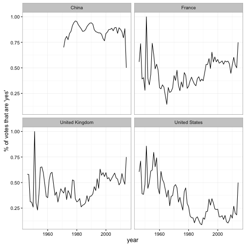

<!-- README.md is generated from README.Rmd. Please edit that file -->


## United Nations General Assembly Voting Data

This data comes from the United Nations voting dataset [found here](https://dataverse.harvard.edu/dataset.xhtml?persistentId=hdl:1902.1/12379). Citation:

Erik Voeten "Data and Analyses of Voting in the UN General Assembly" Routledge Handbook of International Organization, edited by Bob Reinalda (published May 27, 2013)

The data processing occurs in the [data-raw](data-raw) folder.

### Datasets


```r
library(ungavotes)

un_votes
#> Source: local data frame [711,275 x 3]
#> 
#>     rcid  vote     country
#>    <dbl> <dbl>       <chr>
#> 1      3     2       Egypt
#> 2      3     1    Honduras
#> 3      3     1  Costa Rica
#> 4      3     1 El Salvador
#> 5      3     3      France
#> 6      3     1     Uruguay
#> 7      3     1       Chile
#> 8      3     1     Ecuador
#> 9      3     1   Argentina
#> 10     3     1       Haiti
#> ..   ...   ...         ...

un_roll_calls
#> Source: local data frame [5,356 x 9]
#> 
#>     rcid session importantvote       date   unres amend  para
#>    <dbl>   <dbl>         <dbl>     <date>   <chr> <dbl> <dbl>
#> 1      3       1             0 1946-01-01  R/1/66     1     0
#> 2      4       1             0 1946-01-02  R/1/79     0     0
#> 3      5       1             0 1946-01-04  R/1/98     0     0
#> 4      6       1             0 1946-01-04 R/1/107     0     0
#> 5      7       1             0 1946-01-02 R/1/295     1     0
#> 6      8       1             0 1946-01-05 R/1/297     1     0
#> 7      9       1             0 1946-02-05 R/1/329     0     0
#> 8     10       1             0 1946-02-05 R/1/361     1     1
#> 9     11       1             0 1946-02-05 R/1/376     0     0
#> 10    12       1             0 1946-02-06 R/1/394     1     1
#> ..   ...     ...           ...        ...     ...   ...   ...
#> Variables not shown: short <chr>, descr <chr>.

un_roll_call_issues
#> Source: local data frame [4,951 x 3]
#> 
#>     rcid short_name                issue
#>    <dbl>      <chr>                <chr>
#> 1     30         me Palestinian conflict
#> 2     34         me Palestinian conflict
#> 3     77         me Palestinian conflict
#> 4   9002         me Palestinian conflict
#> 5   9003         me Palestinian conflict
#> 6   9004         me Palestinian conflict
#> 7   9005         me Palestinian conflict
#> 8   9006         me Palestinian conflict
#> 9    128         me Palestinian conflict
#> 10   129         me Palestinian conflict
#> ..   ...        ...                  ...
```

### Example analysis


```r
library(dplyr)
library(lubridate)

by_country_year <- un_votes %>%
  inner_join(un_roll_calls, by = c("session", "rcid")) %>%
  group_by(year = year(date), country) %>%
  summarize(votes = n(),
            percent_yes = mean(vote == 1))
#> Error in eval(expr, envir, enclos): 'session' column not found in lhs, cannot join

by_country_year
#> Source: local data frame [9,496 x 4]
#> Groups: year [68]
#> 
#>     year                         country votes percent_yes
#>    <dbl>                           <chr> <int>       <dbl>
#> 1   1946                     Afghanistan    17   0.4117647
#> 2   1946                       Argentina    43   0.6976744
#> 3   1946                       Australia    43   0.5581395
#> 4   1946                         Belarus    43   0.4418605
#> 5   1946                         Belgium    43   0.6046512
#> 6   1946 Bolivia, Plurinational State of    43   0.6976744
#> 7   1946                          Brazil    43   0.6046512
#> 8   1946                          Canada    42   0.6428571
#> 9   1946                           Chile    43   0.6046512
#> 10  1946                        Colombia    42   0.3095238
#> ..   ...                             ...   ...         ...
```

After which this can be visualized for one or more countries:


```r
library(ggplot2)
theme_set(theme_bw())

countries <- c("United States", "United Kingdom", "China", "France")

by_country_year %>%
  filter(country %in% countries) %>%
  ggplot(aes(year, percent_yes)) +
  geom_line() +
  facet_wrap(~ country) +
  ylab("% of votes that are 'yes'")
```



### Code of Conduct

Please note that this project is released with a [Contributor Code of Conduct](CONDUCT.md). By participating in this project you agree to abide by its terms.
