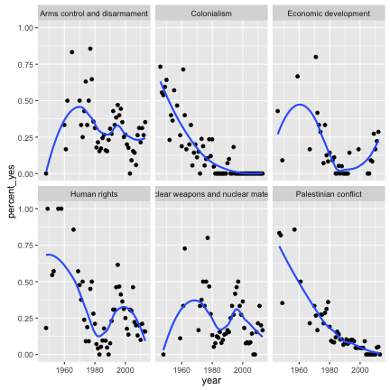

<!-- README.md is generated from README.Rmd. Please edit that file -->


## United Nations General Assembly Voting Data

[](https://travis-ci.org/dgrtwo/unvotes)

This package provides the voting history of countries in the [United Nations General Assembly](http://www.un.org/en/ga/), along with information such as date, description, and topics for each vote.

These come from the dataset [found here](https://dataverse.harvard.edu/dataset.xhtml?persistentId=hdl:1902.1/12379):

> Erik Voeten "Data and Analyses of Voting in the UN General Assembly" Routledge Handbook of International Organization, edited by Bob Reinalda (published May 27, 2013)

This raw data, and the processing script, can be found in the [data-raw](data-raw) folder.

### Installation

Install the package using [devtools](https://github.com/hadley/devtools) with:


```r
devtools::install_github("dgrtwo/unvotes")
```

### Datasets

The package contains three datasets. First is the history of each country's vote. These are represented in the `un_votes` dataset, with one row for each country/vote pair:


```r
library(dplyr)
library(unvotes)

un_votes
#> Source: local data frame [711,275 x 3]
#> 
#>     rcid     country    vote
#>    <dbl>       <chr>  <fctr>
#> 1      3       Egypt abstain
#> 2      3    Honduras     yes
#> 3      3  Costa Rica     yes
#> 4      3 El Salvador     yes
#> 5      3      France      no
#> 6      3     Uruguay     yes
#> 7      3       Chile     yes
#> 8      3     Ecuador     yes
#> 9      3   Argentina     yes
#> 10     3       Haiti     yes
#> ..   ...         ...     ...
```

The package also contains a dataset of information about each roll call vote, including the date, description, and relevant resolution that was voted on:


```r
un_roll_calls
#> Error in eval(expr, envir, enclos): object 'un_roll_calls' not found
```

Finally, the `un_roll_call_issues` dataset shows relationships betwen each vote and 6 issues:


```r
un_roll_call_issues
#> Source: local data frame [4,951 x 3]
#> 
#>     rcid short_name                issue
#>    <dbl>      <chr>                <chr>
#> 1     30         me Palestinian conflict
#> 2     34         me Palestinian conflict
#> 3     77         me Palestinian conflict
#> 4   9002         me Palestinian conflict
#> 5   9003         me Palestinian conflict
#> 6   9004         me Palestinian conflict
#> 7   9005         me Palestinian conflict
#> 8   9006         me Palestinian conflict
#> 9    128         me Palestinian conflict
#> 10   129         me Palestinian conflict
#> ..   ...        ...                  ...

count(un_roll_call_issues, issue, sort = TRUE)
#> Source: local data frame [6 x 2]
#> 
#>                                  issue     n
#>                                  <chr> <int>
#> 1                 Palestinian conflict  1047
#> 2                          Colonialism   971
#> 3                         Human rights   901
#> 4         Arms control and disarmament   859
#> 5 Nuclear weapons and nuclear material   712
#> 6                 Economic development   461
```

(Use `help()` to get information and documentation about each dataset).

### Example analysis

Many useful analyses will first involve joining the vote and roll call datasets by the shared `rcid` (roll call ID) column:


```r
library(dplyr)

joined <- un_votes %>%
  inner_join(un_roll_calls, by = "rcid")
#> Error in eval(expr, envir, enclos): object 'un_votes' not found

joined
#> Error in eval(expr, envir, enclos): object 'joined' not found
```

One could then count how often each country votes "yes" on a resolution in each year:


```r
library(lubridate)

by_country_year <- joined %>%
  group_by(year = year(date), country) %>%
  summarize(votes = n(),
            percent_yes = mean(vote == "yes"))
#> Error in eval(expr, envir, enclos): object 'joined' not found

by_country_year
#> Error in eval(expr, envir, enclos): object 'by_country_year' not found
```

After which this can be visualized for one or more countries:


```r
library(ggplot2)
theme_set(theme_bw())

countries <- c("United States", "United Kingdom", "India", "France")

# there were fewer votes in 2013
by_country_year %>%
  filter(country %in% countries, year <= 2013) %>%
  ggplot(aes(year, percent_yes, color = country)) +
  geom_line() +
  ylab("% of votes that are 'Yes'")
#> Error in eval(expr, envir, enclos): object 'by_country_year' not found
```


Similarly, we could look at how the voting record of the United States has changed on each of the issues by joining with the `un_roll_call_issues` dataset:


```r
joined %>%
  filter(country == "United States") %>%
  inner_join(un_roll_call_issues, by = "rcid") %>%
  group_by(year = year(date), issue) %>%
  summarize(votes = n(),
            percent_yes = mean(vote == "yes")) %>%
  filter(votes > 5) %>%
  ggplot(aes(year, percent_yes)) +
  geom_point() +
  geom_smooth(se = FALSE) +
  facet_wrap(~ issue)
```



### Code of Conduct

Please note that this project is released with a [Contributor Code of Conduct](CONDUCT.md). By participating in this project you agree to abide by its terms.
